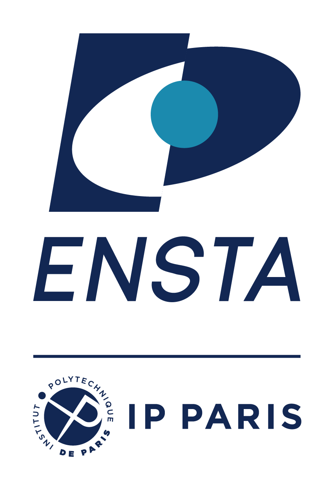
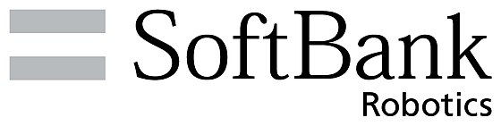

# Code for NeurIPS 2019 paper.
<h1 align="center"> <i> <b> "Symmetry-Based Disentangled Representation Learning requires Interaction with Environments" </i> </b></h1>

This repository contains the official code for the NeurIPS 2019 paper "Symmetry-Based Disentangled Representation Learning requires Interaction with Environments" by Hugo Caselles-Dupré, Michael Garcia-Ortiz and David Filliat.

> **Symmetry-Based Disentangled Representation Learning requires Interaction with Environments** 
> Hugo Caselles-Dupré ¹ ², Michael Garcia-Ortiz ² and David Filliat ¹ 
>¹ Flowers Laboratory (ENSTA Paris   & INRIA )   
>² Softbank Robotics Europe   
> https://arxiv.org/abs/1904.00243
>
> **Abstract:** *Finding a generally accepted formal definition of a disentangled representation in the context of an agent behaving in an environment is an important challenge towards the construction of data-efficient autonomous agents. Higgins et al. recently proposed Symmetry-Based Disentangled Representation Learning, a definition based on a characterization of symmetries in the environment using group theory. We build on their work and make observations, theoretical and empirical, that lead us to argue that Symmetry-Based Disentangled Representation Learning cannot only be based on fixed data samples. Agents should interact with the environment to discover its symmetries.*

   
  <a href="url">Open Colab Notebook to reproduce paper's experiments.</a>

------------------------

## Resources

All material related to our paper is available via the following links:

| Link                      | Description
| :--------------           | :----------
| https://arxiv.org/abs/1904.00243 | Paper PDF.
| Coming soon. | Summary video.
| Coming soon. | Colab to reproduce experiments.
| https://github.com/Caselles/Symmetry_based_Disentanglement  | Source code.
| Coming soon.  | Presentation slides.
